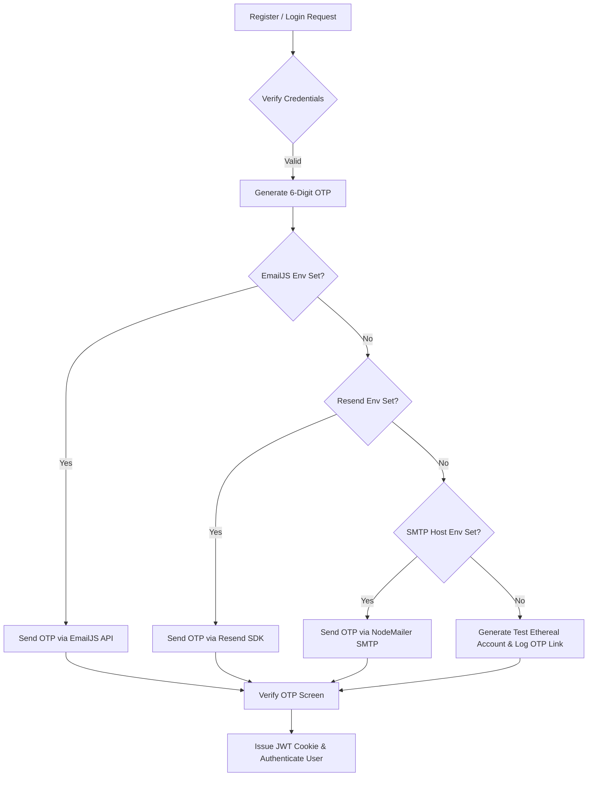

# AI-Powered Resume & Interview Strategist

An advanced, full-stack platform that analyzes your resume (or self-description) and target job description to generate customized interview preparation roadmaps, customized technical and behavioral Q&As, highlight key skill gaps, calculate matching scores, and generate tailored, ATS-friendly resumes in PDF format using Google Gemini AI.

---

##  Key Features

*   **Secure Authentication & OTP Verification**: High-security user registration and login verified via one-time passwords (OTP).
*   **Dual Profile Inputs**: Drag-and-drop resume parser (PDF/DOCX) or structured text self-description.
*   **AI-Powered Job Analysis**: Compares candidate profile against target job description using Gemini AI (`gemini-2.5-flash`).
*   **Structured Preparation Roadmaps**: Personalized daily study/practice roadmap.
*   **Targeted Interview Questions**: Technical and behavioral Q&A sets complete with the interviewer's intention and model answers.
*   **Skill Gap Profiling**: Visual identification of missing competencies and their severity.
*   **Tailored Resume Generation**: Dynamic, ATS-friendly HTML-to-PDF resume generation using headless Puppeteer.

---

##  Project Structure

```
resume-report/
├── BACKEND/                    # Node.js + Express backend service
│   ├── src/
│   │   ├── config/             # Database connection setup
│   │   ├── controllers/        # Express route controllers
│   │   ├── middlewares/        # Authentication & file upload middlewares
│   │   ├── models/             # Mongoose schemas (user, otp, interviewReport)
│   │   ├── routes/             # Route files (auth.routes, interview.routes)
│   │   └── services/           # Business logic (ai, email, puppeteer services)
│   ├── server.js               # Application entry point
│   ├── ecosystem.config.js     # PM2 configuration
│   └── package.json
│
├── FRONTEND/                   # React + Vite client application
│   ├── src/
│   │   ├── features/
│   │   │   ├── auth/           # Login, registration, context, hooks
│   │   │   └── interview/      # Dashboard, reports, hooks, services, styles
│   │   ├── styles/             # Global style configurations
│   │   ├── App.jsx             # Router and configuration setup
│   │   └── main.jsx            # React root mount point
│   ├── index.html
│   ├── vite.config.js
│   └── package.json
│
└── render.yaml                 # Render hosting deployment configuration
```

---

##  Technical Architecture & System Flows

### 1. Authentication & OTP Delivery Pipeline
To secure authentication, the backend utilizes a cascading OTP mechanism:


### 2. Interview Plan Generation Flow
When a user submits a job description along with a resume or self-description:
1.  **Resume Parsing**: The backend handles PDF uploads via `pdf-parse` to convert raw buffers into plain text.
2.  **Structured AI Prompting**: The text, self-description, and target job description are sent to Google Gemini API using the `@google/genai` SDK.
3.  **JSON Schema Validation**: We pass a structured Zod schema (`interviewReportSchema`) to the Gemini model to ensure the output aligns exactly with our UI expectations.
4.  **Database Sync**: The generated report is persisted in MongoDB and mapped to the authenticated user.

### 3. Dynamic PDF Resume Generation
1.  When a user downloads their tailored resume, the server calls the Gemini API to construct professional, ATS-friendly HTML of the resume tailored to the target role.
2.  This HTML is loaded into a headless **Puppeteer** browser instance.
3.  Puppeteer prints the pages to a PDF buffer, which is immediately sent as an attachment download (`resume_[id].pdf`) to the user.

---

##  Environment Variables

Configure these files in their respective folders:

### Backend (`BACKEND/.env`)
```ini
PORT=3000
MONGO_URI=mongodb+srv://<username>:<password>@cluster.mongodb.net/resume-report
GOOGLE_GENAI_API_KEY=your_gemini_api_key_here
JWT_SECRET=your_jwt_secret_here

# Optional: Email Delivery Channels (Cascades from top to bottom)
EMAILJS_SERVICE_ID=your_emailjs_service_id
EMAILJS_TEMPLATE_ID=your_emailjs_template_id
EMAILJS_PUBLIC_KEY=your_emailjs_public_key
EMAILJS_PRIVATE_KEY=your_emailjs_private_key

RESEND_API_KEY=re_your_resend_api_key
RESEND_FROM_EMAIL=onboarding@resend.dev

SMTP_HOST=smtp.gmail.com
SMTP_PORT=587
SMTP_USER=your_email@gmail.com
SMTP_PASS=your_app_password
```

### Frontend (`FRONTEND/.env`)
```ini
VITE_API_BASE_URL=http://localhost:3000
```

---

##  Getting Started

### Prerequisites
*   Node.js (v18+)
*   MongoDB Instance
*   Gemini API Key

### Step 1: Run the Backend
```bash
cd BACKEND
npm install
npm run dev
```

### Step 2: Run the Frontend
```bash
cd FRONTEND
npm install
npm run dev
```
Open [http://localhost:5173](http://localhost:5173) in your browser.

---

##  Deployment (Render)

This workspace is fully prepared for zero-configuration hosting on Render via the defined [render.yaml](file:///d:/GEN%20AI%20PROJECT/resume-report/render.yaml) file:

1.  Push the code repository to GitHub.
2.  Create a new **Blueprint Instance** in your Render Dashboard.
3.  Connect this repository. Render will automatically parse `render.yaml` to spin up your backend web service and request the required environment variables.
